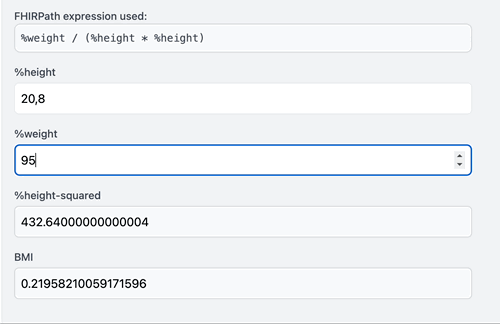

# FHIRPath 🔥 Jotai
> Make FHIRPath calculations reactive using Jotai.

Ever wanted to make your FHIRPath expressions reactive? Now you can! This library provides a way to use FHIRPath expressions in a reactive way using Jotai.

> [!IMPORTANT]
> This is repository is still in a early stage and not production ready yet. 📢 Stay tuned for more info. 👋 Reach out if you'd like to help.

<!--
## Installation
```bash
npm install fhirpath-jotai
```
-->

## Usage

```tsx
import { atom } from 'jotai';
import { expressionAtom } from 'fhirpath-jotai';

const heightAtom = atom(180);
const weightAtom = atom(80);

const bmiExpressionAtom = expressionAtom('%weight / (%height/100).power(2)', {
  weight: weightAtom,
  height: heightAtom,
});
```

## Granular updates 🎯

The `expressionAtom` will only update when the values it depends on change. This means that if you have multiple expressions that depend on the same atoms, only the expressions that are affected by the change will update.

